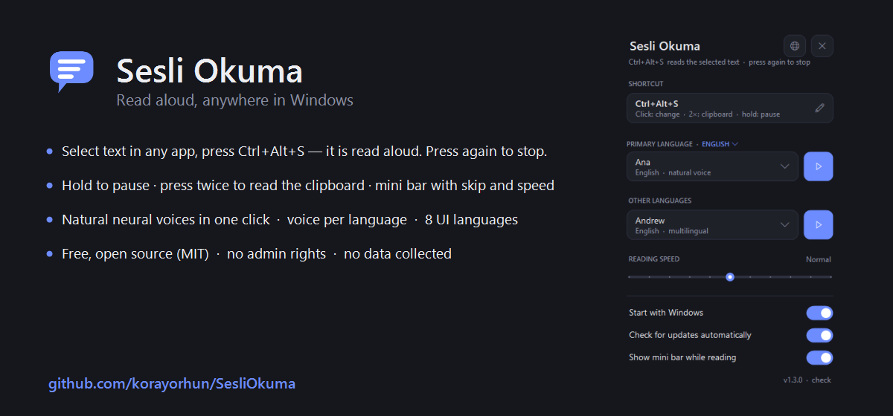
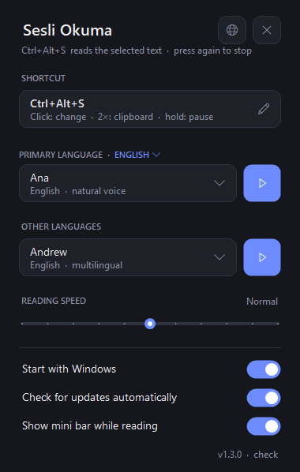
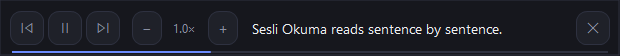
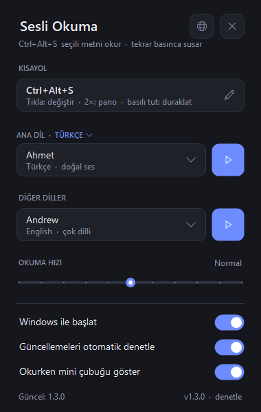

<p align="center"></p>

<p align="center">
<a href="https://github.com/korayorhun/SesliOkuma/releases/latest"></a>
<a href="https://github.com/korayorhun/SesliOkuma/releases"></a>
<a href="LICENSE.txt"></a>
<a href="https://github.com/sponsors/korayorhun"></a>
</p>

**English** · [Türkçe](#türkçe)

# Sesli Okuma

**Sesli Okuma** (Turkish for "read aloud") is a tiny Windows 10/11 tray tool: **select text in any application and press a shortcut** (default `Ctrl + Alt + S`) to hear it read aloud — press again to stop. Click the tray icon for a minimal panel with the shortcut, voices per language, reading speed and interface language.

<p align="center"></p>
<p align="center"></p>

## Highlights

- **One shortcut, three gestures** — press: read the selection (or the paragraph under the mouse when nothing is selected) / stop; press twice: read the clipboard; hold: pause / resume.
- **Mini bar while reading** — a thin bar at the bottom of the screen shows the current sentence with pause, previous/next sentence and speed; it disappears when reading ends (can be turned off).
- **Works everywhere** — browsers, Office, PDF readers, chat apps, IDEs. Text is taken through UI Automation; apps that don't expose it fall back to a transparent copy that restores your clipboard.
- **Natural voices in one click** — the panel offers to install the open-source [NaturalVoiceSAPIAdapter](https://github.com/gexgd0419/NaturalVoiceSAPIAdapter), adding Microsoft's online neural voices (Turkish *Emel/Ahmet*, English *Andrew/Ava/Aria…*, and multilingual voices). Windows voice packs can be added from the panel too.
- **Voice per language** — the script/language of the selected text is detected; primary-language text uses your primary voice, everything else your second voice.
- **8 interface languages** — English, Türkçe, 中文, हिन्दी, Español, Français, العربية, Português. Switch instantly; the installer speaks them too.
- **Your shortcut** — click the field, press a combination; conflicts are reported and the old shortcut kept.
- **Auto-update** — daily check against GitHub Releases, SHA-256-verified download, silent install, restart. Can be turned off.
- **Respectful** — per-user install, no admin rights, **no telemetry**; text goes only to the Windows speech provider (SAPI) you choose. MIT licensed.

## Install

Download the latest `SesliOkuma-Setup-x.y.z.exe` from **[Releases](https://github.com/korayorhun/SesliOkuma/releases/latest)** and run it (no admin rights). The package is not code-signed yet, so SmartScreen may show "unrecognized app": *More info → Run anyway*.

| Action | How |
|---|---|
| Read selected text | select text → `Ctrl + Alt + S` (or your shortcut) |
| Stop | press the shortcut again (or tray icon → Stop) |
| Pause / resume | hold the shortcut ~1 s, or the mini bar |
| Read clipboard | press the shortcut twice |
| Settings | click the tray icon (or run the exe again) |
| Interface language / About | globe icon in the panel |
| Quit | tray icon → right-click → Exit |

## Build from source

No SDK needed — the C# compiler shipped with .NET Framework 4.8 is enough:

```powershell
.\build.ps1                  # src\*.cs -> SesliOkuma.exe (and start it)
.\release.ps1 -Version 1.3.0 # bump, build, installer, tag, GitHub release
```

The installer needs [Inno Setup 6](https://jrsoftware.org/isinfo.php) (`installer\SesliOkuma.iss`; copy the unofficial `Hindi.islu` into Inno's `Languages` folder for Hindi).

## Support

If Sesli Okuma saves you time, a one-time coffee via **[GitHub Sponsors](https://github.com/sponsors/korayorhun)** is appreciated — no strings attached. Bug reports and ideas: [Issues](https://github.com/korayorhun/SesliOkuma/issues) · [Discussions](https://github.com/korayorhun/SesliOkuma/discussions).

---

# Türkçe

Windows 10/11 için küçük bir sistem tepsisi aracı: **herhangi bir uygulamada seçtiğiniz metni bir kısayolla sesli okur** (varsayılan `Ctrl + Alt + S`), tekrar basınca susar. İkona tıklayınca açılan minimal panelden kısayolu, ana dili ve sesleri, okuma hızını ve arayüz dilini seçersiniz.

<p align="center"></p>

- **Tek kısayol, üç jest** — bas: seçimi (seçim yoksa imlecin altındaki paragrafı) oku / sustur; iki kez bas: panoyu oku; basılı tut: duraklat / devam.
- **Okurken mini şerit** — ekranın altında ince bir çubuk: okunan cümle, duraklat, önceki/sonraki cümle, hız; okuma bitince kaybolur (kapatılabilir).
- **Her yerde çalışır** — tarayıcı, Office, PDF, sohbet, IDE. Metin UI Automation ile alınır; vermeyen uygulamalarda panonuzu geri yükleyen şeffaf bir kopyalama yoluna düşer.
- **Doğal sesler tek tıkla** — panel, açık kaynak [NaturalVoiceSAPIAdapter](https://github.com/gexgd0419/NaturalVoiceSAPIAdapter)'ı kurmayı önerir: Emel, Ahmet ve 15+ İngilizce neural ses, çok dilli sesler (internet gerekir). Windows ses paketleri de panelden eklenir.
- **Dile göre ses** — seçili metnin dili algılanır; ana dil metinleri ana dil sesiyle, diğerleri ikinci sesle okunur.
- **8 arayüz dili**, **kendi kısayolunuz**, **otomatik güncelleme** (SHA-256 doğrulamalı, kapatılabilir).
- Kurulum yönetici yetkisi istemez; **veri toplamaz**. Ayarlar ve günlük: `%LOCALAPPDATA%\SesliOkuma\`.

**Kurulum:** [Releases](https://github.com/korayorhun/SesliOkuma/releases/latest) sayfasından `SesliOkuma-Setup-x.y.z.exe`. İmzasız olduğu için SmartScreen uyarısı çıkabilir: *Ek bilgi → Yine de çalıştır*.

**Hakkında & destek:** dil menüsünün altındaki *Hakkında* kartında kaynak kod, sürüm notları, sorun bildirme ve isteğe bağlı **Destek ol ♥** (GitHub Sponsors, tek seferlik) bulunur.

## Lisans

MIT — bkz. [LICENSE.txt](LICENSE.txt).